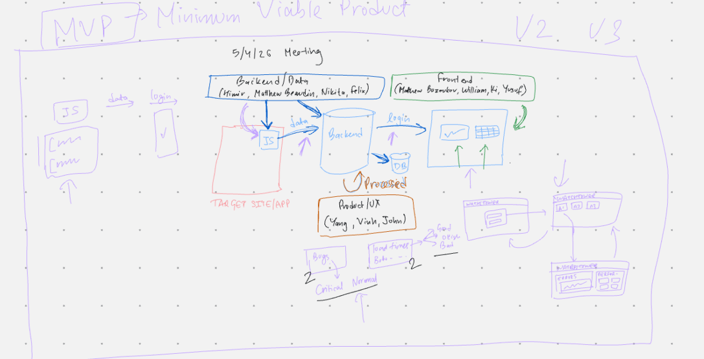

# Weekly Meeting for Team 08 - Seven Ate Nine

**Date: May 4, 2026**\
**Location: Zoom**\
**Start Time:** 4:06PM\
**End Time:** 4:37PM

**Present:** Himir Desai, Matthew Bozoukov, John Bolibol, Yusuf Damda, Vinh Tong, Felix Tong, Ki Diaz, Matthew Beaudin, Yang Bie, Nikita Jos\
**Late:** \
**Absent:** William Ayoade

## Meeting Outline and Goals

This meeting serves as the official Sprint Planning session for the project. The team defined the project scope, team structure, sprint goals, and the specific tasks for each team during Sprint 1. This is the first planning standup where we establish the foundation for all upcoming sprints.

- [Weekly Meeting for Team 08 - Seven Ate Nine](#weekly-meeting-for-team-08---seven-ate-nine)
  - [Meeting Outline and Goals](#meeting-outline-and-goals)
  - [Discussion](#discussion)
    - [Project Overview](#project-overview)
    - [Team Structure](#team-structure)
    - [Sprint Structure](#sprint-structure)
    - [Sprint 1 Standups and Team Tasks](#sprint-1-standups-and-team-tasks)
  - [Takeaways and Summary](#takeaways-and-summary)
  - [Action Items](#action-items)

## Discussion

### Project Overview

**Project Name:** WatchTower

**Project Goal:** Develop a performance and error monitoring dashboard that third-party applications can integrate with. We will create a JavaScript file that third-party apps can embed into their applications to collect performance and error data. This collected data will be processed by our backend and displayed on the frontend dashboard.

**Architecture:**

- **Data Collection:** Embedded JS file in target apps that collects performance and error metrics
- **Backend:** Processes and stores collected data in database
- **Frontend:** Displays processed data in dashboard UI for visualization and monitoring

### Team Structure

The 11-member team is divided into three specialized teams:

**Backend Team (4 members):**

- Himir Desai
- Matthew Beaudin
- Nikita Jos
- Felix Tong

**Frontend Team (4 members):**

- Matthew Bozoukov
- William Ayoade
- Ki Diaz
- Yusuf Damda

**Product & UX Team (3 members):**

- Yang Bie
- Vinh Tong
- John Bolibol

### Sprint Structure

The project is planned across 4 sprints:

- **Sprint 1:** Planning phase - everything in super detail
- **Sprint 2:** Starting to implement features
- **Sprint 3:** Connecting all the teams' work together
- **Sprint 4:** Bug fixes and finishing touches

### Sprint 1 Standups and Team Tasks

**Standup 1: Decide on Core Components**

Each team will make foundational technical and design decisions:

- **Backend Team:** Decide on login and database implementation, determine database structure and technology
- **Product Team:** Decide what data to collect from target applications, define data requirements and metrics
- **Frontend Team:** Decide on theme/design system, plan charts and visualization components

**Standup 2: Implementation Strategy**

Each team will define how their decisions will be implemented:

- **Backend Team:** Decide how to collect data from the embedded JS file, determine data collection API/protocol
- **Product Team:** Decide how to process collected data, define data transformation and analysis logic
- **Frontend Team:** Decide how to display data, plan UI/UX for dashboard presentation

**Standup 3: Documentation & User Stories**

All teams will document their research and create user stories:

- Each team writes down their research findings in individual team markdown files
- Create user stories related to each team's responsibilities
- Document all technical decisions and rationale

## Takeaways and Summary

The team has established a clear project scope for a performance/error dashboard with an embedded JS collector. The three specialized teams are well-defined, and each team understands their roles in the three-standup planning process for Sprint 1. The sprint structure provides clear milestones: planning in Sprint 1, implementation in Sprint 2, integration in Sprint 3, and bug fixes in Sprint 4.

## Action Items

- Each team completes research and decision-making during Standup 1
- Each team documents findings and decisions in individual team markdown files (backend.md, frontend.md, product.md)
- Each team creates user stories related to their responsibilities for Standup 3
- Prepare for Sprint 2 feature implementation after Sprint 1 planning completion
