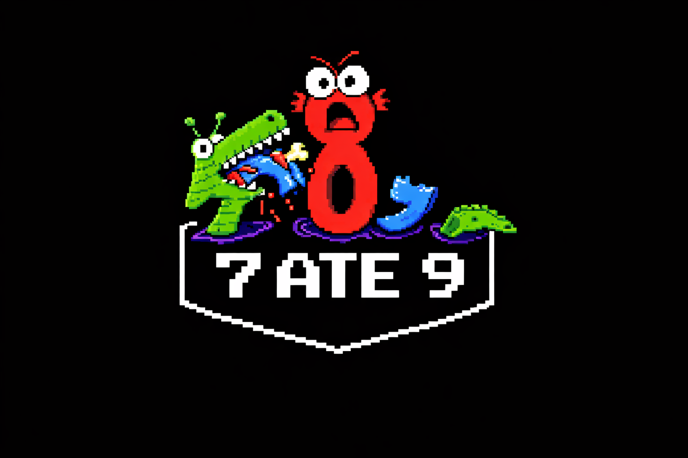
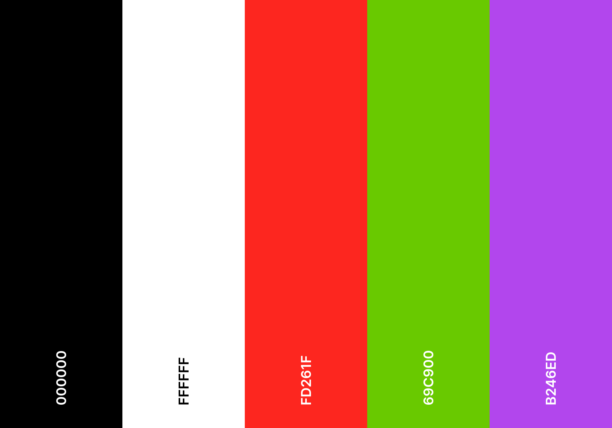

# Team Name: Seven Ate Nine

> ## **Why is Six afraid of Seven?**

# Values

- As all of us are doing this for the first time, we should understand that mistakes will be made. These mistakes should not be seen as as failures but as learning experinces where we can grow and learn as developers. One of our key values will be learning to understand one another and help bring each other when there is uncertainty in the project.

- I think we also all want to be able to meet deadlines. Our second value will be punctionality, meaning that when you are assigned work, you will do it on time and to the best of your abillity.

- We must treat each team member with respect and when disagreements happen, we should be cordial about it. We should not point fingers when stuff goes wrong and instead work together to come up with a solution.

- Our last value should be to enjoy the work we do. It's easy to get caught up in just trying to finish the assignment, however we should also enjoy working together and to not forget that this can be fun!

# Team Members

[Team Video](./videos/teamintro.mp4)

## Himir Desai

- **Role:** Team Leader, Backend Developer, GitHub Management
- **Background:** 2nd year Computer Science student with experience in C/C++, HTML, CSS, JavaScript/TypeScript, Python
- **Interests:** Playing video games, travelling, driving, learning new skills and programming
- **Strengths:** Organized, quick communicator, reliable
- **Personal Page:** [View Page](https://himir-desai.github.io/CSE110-Lab1/)

---

## Matthew Bozoukov

- **Role:** Team Lead and Developer
- **Background:** Computer Science student with experience in Python, ML, and Java
- **Interests:** ML engineering, AI safety, becoming a better engineer
- **Strengths:** Takes criticism well, fast learner
- **Personal Page:** [View Page](https://matthew-bozoukov.github.io/Matthew-page/)

---

## Felix Tong

- **Role:** Backend Developer, Architecture Design, GitHub Management
- **Background:** 2nd Year Computer Science student with experience in C/C++, Python, and Java
- **Interests:** Video games, technology, sports
- **Strengths:** Adaptable, proactive, communicative
- **Personal Page:** [View Page](https://aegislock.github.io/aegislock-github-pages/)

---

## Yang Bie

- **Role:** Backend Developer, Frontend Developer, Architecture Design
- **Background:** Computer Science student with experience in C, C++, Java, and Python; building skills in software development and AI
- **Interests:** Working out, software development, self-improvement, learning new technologies
- **Strengths:** Reliable, open to feedback, hardworking, easy to work with
- **Personal Page:** [View Page](https://yang-bie.github.io/CSE_110_Lab1/)

---

## Vinh Tong

- **Role:** Developer (Front-end & Back-end), Architecture Design, GitHub Management
- **Background:** 2nd year Computer Science student with experience in Java, C, and Assembly
- **Interests:** Playing video games, self-improvement
- **Strengths:** Problem-solving, adaptable, fast learner, reliable
- **Personal Page:** [View Page](https://vtong06.github.io/CSE110-Lab1/)

---

## Ki Diaz

- **Role:** Backend Developer
- **Background:** 3rd year Computer Science major with experience in C, C++, Python, and Java
- **Personal Page:** [View Page](https://kicode-ucsd.github.io/)

---

## Matthew Beaudin

- **Role:** Developer (Front-end & Back-end), GitHub Manager
- **Background:** 3rd year Computer Science student with experience in Java, C++, Dart, Python, and Kotlin
- **Interests:** Personal projects, challenging self, building team skills
- **Strengths:** Good communicator, willing to learn, hardworking
- **Personal Page:** [View Page](https://matthewb234.github.io/CSE110-github-pages/)

---

## John Bolibol

- **Role:** Developer
- **Background:** CS-Bioinformatics major researching alternative splicing in progenitor cells
- **Interests:** Spending time with his 4-year-old rescue dog, June
- **Personal Page:** [View Page](https://jhnkb.github.io/CSE110-Repo/)

---

## Yusuf Damda

- **Role:** Developer (Front-end & Back-end)
- **Background:** Computer Science student with experience in Java, C, and C++; expanding into Python
- **Interests:** Self-improvement, growing as a developer, learning new skills
- **Strengths:** Reliable, open to feedback, easy to work with
- **Personal Page:** [View Page](https://yusufdamda-ucsd.github.io/CSE110-lab1/)

---

## William Ayoade

- **Role:** Backend Developer, Architecture Design
- **Background:** 3rd year Math-CS student with experience in machine learning projects
- **Interests:** Machine learning, mathematics, finance
- **Strengths:** Flexible, strong problem-solving skills
- **Personal Page:** [View Page](https://williamayoade.github.io/lab1-GitHub-Pages-project)

---

## Nikita Jos

- **Role:** Developer
- **Background:** Computer Science major with experience in Java, Python, and PostgreSQL
- **Interests:** Full-stack development, databases
- **Personal Page:** [View Page](https://nikitajos7.github.io/CSE110Lab1/)

# Branding Information

## Fonts

[**Heading :** Press Start 2P](https://fonts.google.com/specimen/Press+Start+2P)

[**Body :** Arimo](https://fonts.google.com/specimen/Arimo)

**HTML import tag**

`<link rel="preconnect" href="https://fonts.googleapis.com">`\
`<link rel="preconnect" href="https://fonts.gstatic.com" crossorigin>`\
`<link href="https://fonts.googleapis.com/css2?family=Arimo:ital,wght@0,400..700;1,400..700&family=Press+Start+2P&display=swap" rel="stylesheet">`

## Colors

**Background:** Black #000000\
**Text:** White #FFFFFF\
**Accent 1:** Red #FD261F\
**Accent 2:** Bright Ferm #69C900\
**Accent 3:** Hyper Magenta #B246ED

[Color Palette](https://coolors.co/000000-ffffff-fd261f-69c900-b246ed)

## Power Point Template
[template link](https://docs.google.com/presentation/d/1f95tAa2uW0V2GVfdlIyrjBwwu9dqRNix041fx2HneWc/edit?slide=id.p#slide=id.p)
